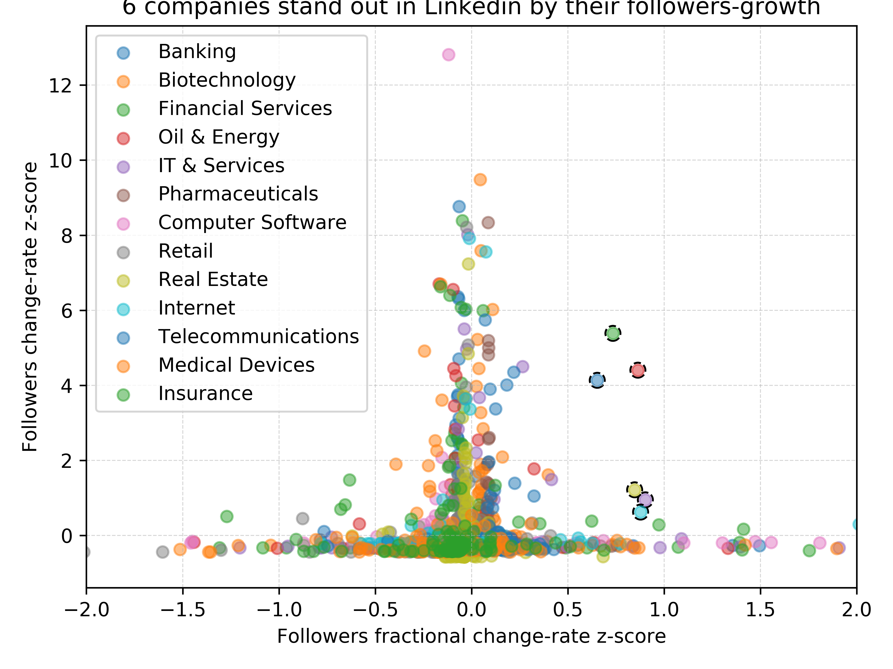

# Project

Propose a project to do while at The Data Incubator. We want to know
about your ability to think at a high level. Try to think of projects
that users or businesses will care about that are also relatively
unanalyzed. Here are some useful links about data sources [on our
blog](http://blog.thedataincubator.com/tag/data-sources/) as well as the
archive of data sources on Data is Plural. You can see some final
projects of previous Fellows [on our YouTube
Page](https://www.youtube.com/playlist?list=PLOE4k9MRzZanWmZ7MBrJFi7ZekYmVqEIV).

Propose a project that uses a large, publicly accessible
dataset. Explain your motivation for tackling this problem, discuss the
data source(s) you are using, and explain the analysis you are
performing. At a minimum, you will need to do enough exploratory data
analysis to convince someone that the project is viable and generate two
interesting non-trivial plots supporting this. *The most impressive
applicants have even finished a "rough draft" of their projects and have
derived non-obvious meaningful conclusions from their data*. Explain the
plots and give url links to them. For guidance on how to choose a
project, check out [this blog
post](http://blog.thedataincubator.com/2017/01/how-employers-judge-data-science-projects/).

## Project description

Linkedin is the biggest social network for people to promote themself
professionally, and for companies to recruit them. The most direct way
for a company to position themselves in the network is via "follower"
users that track their developments and announcements.

In this project I will analyse the followers-count of individual
companies, in order to develop and mathematical model that describes how
followers-count are expected to change over time. I will use this model
to identify companies that grow faster than expected, hoping to learn
how companies can accelerate their positioning within LinkedIn.

Preliminary, I have analysed a
[database](https://s3-us-west-2.amazonaws.com/documents.thinknum.com/dataset_dump/flikerqvnk/temp_datalab_records_linkedin_company.zip)
tracking the followers-count of about 5000 companies, spanning from
September 2015 to July 2018. Inspection showed that the company's follower-counts approximate a
linear relation with time (R_values have 0.9 average and 0.3 standard
deviation, data not shown). For each company I estimated the
follower-counts change-rate and fractional "follower counts" change-rate
using a linear model, separated them by industry sector, and estimated a
z-score based on each sector's distribution.

The scatter plot in [Figure
1](https://github.com/sebajara/dataincubator_challenge/tree/master/project/FIG1.png)
shows that while some companies grow very fast in absolute
follower-counts compared to the rest, they do not necessarily grow very
fast relative to their size (values tend to the center in the fractional
follower-counts change-rate axis). However, a few companies scape from
this trend. Circled companies in [figure
1](https://github.com/sebajara/dataincubator_challenge/tree/master/project/FIG1.png)
correspond to cases where the z-score is bigger than 0.5 in both
axis. In particular, those companies are:
[Aon](https://www.linkedin.com/company/aon) (Financial Services),
[Eni](https://www.linkedin.com/company/eni) (Oil & Energy), [Western
Digital](https://www.linkedin.com/company/western-digital) (Information
Technology and Services), [GGP
Inc.](https://www.linkedin.com/company/ggp-inc.) (Real Estate),
[YouTube](https://www.linkedin.com/company/youtube) (Internet), and
[Telefonica](https://www.linkedin.com/company/telef%C3%B3nica)
(Telecommunications).

While the followers appear to follow a linear growth, surprisingly we
find that the followers change-rate is well correlated with the
followers size of each company, in this case represented by their most
recent value (see scatter plot in [figure
2](https://github.com/sebajara/dataincubator_challenge/tree/master/project/FIG2.png).
In the ideal case the number of potential new followers were unlimited,
this correlation should result in an exponential growth, not
linear. This discrepancy suggests that the growth of company followers is
limited, probably as a balance between competition among companies of
the same industry, reducing size of old users available to add as
followers, and the addition of new users to the platform.

Future work will involve adjuring data for the growth of numbers of
users through the network, and attributes that may help us identify
their potential industry interests. In parallel, I will evaluate
mathematically different scenarios of competition between companies in
order to identify a model that accurately describes how followers are
expected to grow over-time. With this, I will identify companies grow in
followers faster than the model, and study the conditions
(e.g. communication strategies, market growth) that allow them to grow
faster than the rest.

### Figures

**Figure 1:**

**Figure 2:**

### Data source

* [link](https://s3-us-west-2.amazonaws.com/documents.thinknum.com/dataset_dump/flikerqvnk/temp_datalab_records_linkedin_company.zip)

### File size

* 910 Mb

## Personal notes

A few comments specifically about the Linkedin data:
* Follower-rates per industry appear not to follow a Gaussian
  distribution, so the z-score is not the correct metric. Perhaps some
  Exponential, Poisson, or something like that. By parameterizing the
  distributions I could have estimated the likelihood of each value, and
  decide who is a "true" outlier.
* I was not able to use the "employees_on_platform" for anything
  useful. I found that is has a very poor correlation overall with
  "followers" over the same period of time, except for a few companies
  in the Banking industry.
* A general caveat of my approach is that I am looking at the rates
  over dissimilar periods of time. This is partially the limitation of
  the database, but I can't tell how much this may affect the results.
* Additional attributes accessible (in principle) from linkedin that
  could enrich the analysis: foundedOn, organizationStatus,
  organicFollowerCount v/s paidFollowerCount.
* Use cusip and isin in order to map company to economics databases.
* Key question is how fast the size of linkedin users and user active
  usage, and how they split for different industry categories.
* Evaluate how far is the data from an exponential growth, assuming it
  may look linear because of the "short" time-scale.

For practising in the future:
* From the application: As you begin to formulate your capstone project,
  we encourage you to start exploring our blog posts on [data sources](https://blog.thedataincubator.com/tag/data-sources/) and
  [Data is Plural](https://tinyletter.com/data-is-plural/archive). You can see previous project videos on our [Youtube
  page](https://www.youtube.com/playlist?list=PLOE4k9MRzZanWmZ7MBrJFi7ZekYmVqEIV), and this blog post about how employers judge [data science
  projects](https://blog.thedataincubator.com/2017/01/how-employers-judge-data-science-projects/).
* [Data source 1](https://blog.thedataincubator.com/2014/10/data-sources-for-cool-data-science-projects-part-1/), 
  [Data source 2](https://blog.thedataincubator.com/2014/10/data-sources-for-cool-data-science-projects-part-2/),
  [Data source 3](https://blog.thedataincubator.com/2016/10/data-sources-for-cool-data-science-projects-part-3/),
  [Data source 4](https://blog.thedataincubator.com/2016/10/data-sources-for-cool-data-science-projects-part-4/),
  [Data source 5](https://blog.thedataincubator.com/2016/10/data-sources-for-cool-data-science-projects-part-5/)

